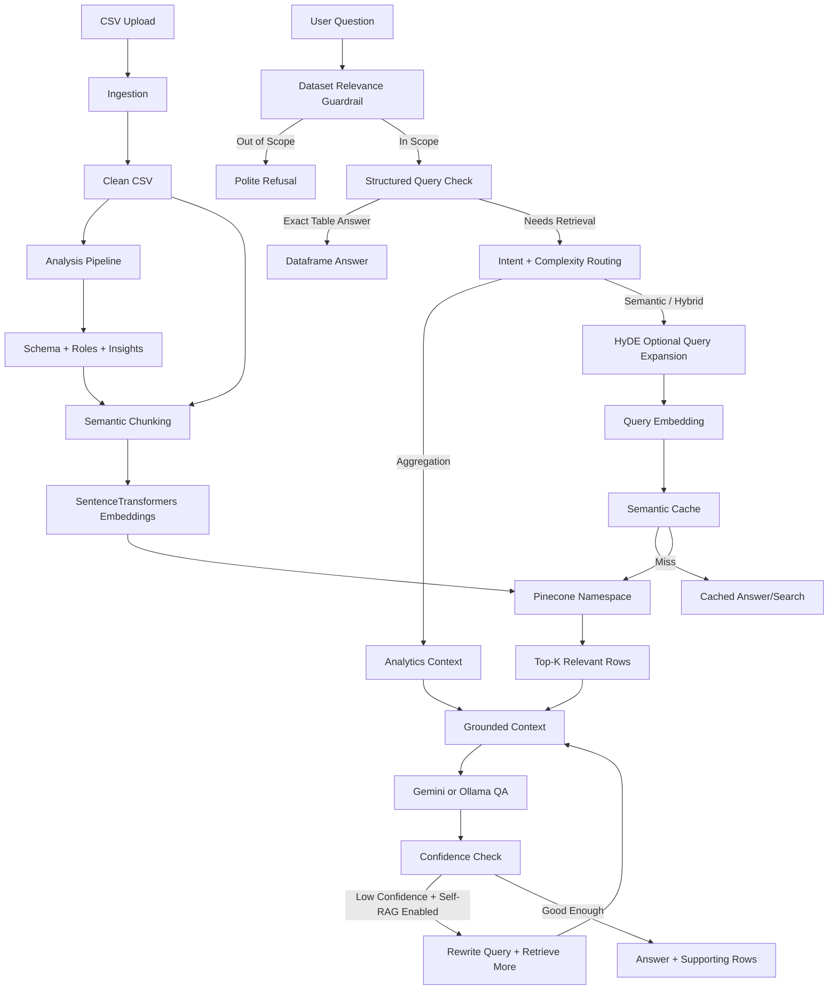

# TextLens AI RAG Architecture

TextLens AI uses a dataset-grounded, hybrid RAG pipeline. It combines structured dataframe answers, analytics summaries, semantic vector retrieval, optional HyDE query expansion, semantic caching, and Gemini/Ollama answer generation.

## High-Level Flow

## What Happens During Ingestion

1. The upload API saves the CSV and runs the ingestion pipeline.
2. The analysis pipeline cleans text, detects schema/column roles, enriches sentiment, generates insights, and saves a clean CSV.
3. The semantic pipeline turns each useful row into structured text chunks.
4. SentenceTransformers creates embeddings for those chunks.
5. Vectors are stored in Pinecone, using the dataset ID as the namespace.

Main files:

- `backend/app/routers/ingestion.py`
- `backend/app/routers/analysis.py`
- `backend/app/services/pipeline.py`
- `backend/app/services/semantic_dataset_service.py`
- `backend/app/services/embedding_service.py`
- `backend/app/services/vector_store_service.py`

## What Happens During Question Answering

1. `DatasetRAGPipeline.answer()` receives the dataset ID and question.
2. `QueryRouter` checks whether the question belongs to the uploaded dataset.
3. `StructuredQueryService` tries to answer exact table questions directly from the clean CSV.
4. If the question needs retrieval, `RetrievalPlanner` chooses one of these strategies:
   - `structured`: direct dataframe lookup/filter/aggregate
   - `analytics`: dataset-level aggregate context
   - `semantic`: vector search only
   - `hybrid`: analytics plus vector search
5. For semantic retrieval, `SemanticRetriever` optionally expands short/vague queries with HyDE, embeds the query, and searches Pinecone.
6. `QAService` builds a grounded prompt and asks Gemini or Ollama.
7. If Self-RAG is enabled and confidence is low, the query is rewritten and retrieval runs again with a larger `top_k`.

Main files:

- `backend/app/services/rag_service.py`
- `backend/app/services/query_router.py`
- `backend/app/services/dataset_relevance_service.py`
- `backend/app/services/structured_query_service.py`
- `backend/app/services/retrieval_planner.py`
- `backend/app/services/semantic_retriever.py`
- `backend/app/services/hyde_service.py`
- `backend/app/services/semantic_cache.py`
- `backend/app/services/qa_service.py`
- `backend/app/services/prompt_builder.py`

## Architecture Type

This is not simple “retrieve top-k then generate” RAG. It is closer to:

**Hybrid routed RAG with structured QA, semantic retrieval, analytics context, HyDE query expansion, semantic caching, and optional Self-RAG refinement.**
