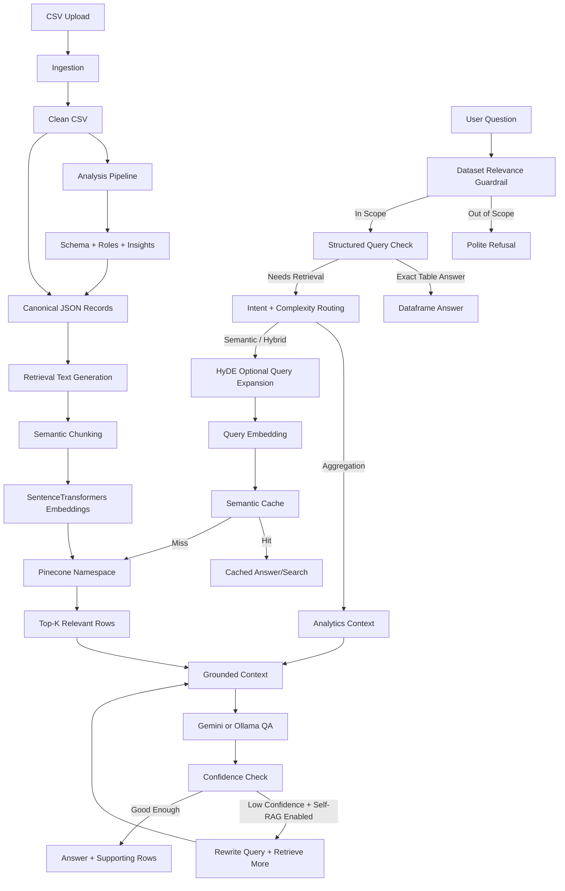

# TextLens AI RAG Architecture

TextLens AI uses a dataset-grounded, hybrid RAG pipeline. It combines structured dataframe answers, analytics summaries, semantic vector retrieval, optional HyDE query expansion, semantic caching, and Gemini/Ollama answer generation.

## High-Level Flow




## What Happens During Ingestion

1. The upload API saves the CSV and runs the ingestion pipeline.
2. The analysis pipeline cleans text, detects schema/column roles, enriches sentiment, generates insights, and saves a clean CSV.
3. The semantic pipeline converts each useful cleaned row into a canonical JSON record.
4. Each canonical record gets retrieval metadata and generated `retrieval_text`.
5. `retrieval_text` is split into semantic chunks when needed.
6. SentenceTransformers creates embeddings for those chunks.
7. Vectors are stored in Pinecone, using the dataset ID as the namespace.

The system does not treat the detected text column as the only retrieval document. It uses the whole cleaned row to preserve business context such as product, rating, title, timestamp, category, sentiment, and duplicate frequency.

## Record-First Semantic Ingestion

The semantic ingestion path is:

```text
Clean CSV row
  -> canonical JSON record
  -> retrieval_text
  -> chunk text
  -> embedding
  -> vector metadata
  -> Pinecone upsert
```

Canonical records are written to:

```text
data/records/{dataset_id}_records.jsonl
```

Chunks are written to:

```text
data/chunks/{dataset_id}_chunks.jsonl
```

Each canonical record has this shape:

```json
{
  "row_id": "dataset123:42",
  "dataset_id": "dataset123",
  "original_row_index": 42,
  "content_hash": "sha256:...",
  "language": "en",
  "quality_score": 0.91,
  "source_file": "reviews.csv",
  "ingestion_timestamp": "2026-06-01T00:00:00+00:00",
  "cleaning_version": "clean_v1",
  "record_schema_version": "record_v1",
  "retrieval_text_version": "retrieval_text_v1",
  "word_count": 24,
  "text_length": 148,
  "duplicate_frequency": 3,
  "primary_text_column": "review",
  "business_fields": {
    "product": "iPhone",
    "rating": 5,
    "review": "Great battery life"
  },
  "retrieval_text": "Customer reviewed iPhone with a rating of 5.\n\nReview:\nGreat battery life\n\nFields:\nProduct: iPhone\nRating: 5\nReview: Great battery life",
  "retrieval_text_hash": "sha256:..."
}
```

Only the generated chunk text is embedded. For short rows, this is usually the full `retrieval_text`.

The vector payload stores compact, filterable metadata:

```json
{
  "dataset_id": "dataset123",
  "row_id": "dataset123:42",
  "original_row_index": 42,
  "chunk_id": 0,
  "content_hash": "sha256:...",
  "retrieval_text_hash": "sha256:...",
  "source_file": "reviews.csv",
  "language": "en",
  "quality_score": 0.91,
  "word_count": 24,
  "text_length": 148,
  "duplicate_frequency": 3,
  "cleaning_version": "clean_v1",
  "record_schema_version": "record_v1",
  "retrieval_text_version": "retrieval_text_v1",
  "primary_text_column": "review",
  "product": "iPhone",
  "rating": 5,
  "col_review": "Great battery life",
  "text": "Customer reviewed iPhone with a rating of 5..."
}
```

This supports modern retrieval patterns:

- semantic search over natural row context
- exact filters over business fields such as `rating`, `product`, `language`, or `quality_score`
- stable re-indexing using `content_hash`
- better citations using `row_id` and `original_row_index`
- duplicate-aware analytics through `duplicate_frequency`

Main files:

- `backend/app/routers/ingestion.py`
- `backend/app/routers/analysis.py`
- `backend/app/services/pipeline.py`
- `backend/app/services/semantic_dataset_service.py`
- `backend/app/services/record_transformer.py`
- `backend/app/services/retrieval_text_builder.py`
- `backend/app/services/embedding_service.py`
- `backend/app/services/vector_store_service.py`

## What Happens During Question Answering

1. `DatasetRAGPipeline.answer()` receives the dataset ID and question.
2. `QueryRouter` checks whether the question belongs to the uploaded dataset.
3. `StructuredQueryService` tries to answer exact table questions directly from the clean CSV.
4. If the question needs retrieval, `RetrievalPlanner` chooses one of these strategies:
   - `structured`: direct dataframe lookup/filter/aggregate
   - `analytics`: dataset-level aggregate context
   - `semantic`: vector search only
   - `hybrid`: analytics plus vector search
5. For semantic retrieval, `SemanticRetriever` optionally expands short/vague queries with HyDE, embeds the query, and searches Pinecone.
6. `QAService` builds a grounded prompt and asks Gemini or Ollama.
7. If Self-RAG is enabled and confidence is low, the query is rewritten and retrieval runs again with a larger `top_k`.

Main files:

- `backend/app/services/rag_service.py`
- `backend/app/services/query_router.py`
- `backend/app/services/dataset_relevance_service.py`
- `backend/app/services/structured_query_service.py`
- `backend/app/services/retrieval_planner.py`
- `backend/app/services/semantic_retriever.py`
- `backend/app/services/hyde_service.py`
- `backend/app/services/semantic_cache.py`
- `backend/app/services/qa_service.py`
- `backend/app/services/prompt_builder.py`

## Architecture Type

This is not simple “retrieve top-k then generate” RAG. It is closer to:

**Hybrid routed RAG with structured QA, semantic retrieval, analytics context, HyDE query expansion, semantic caching, and optional Self-RAG refinement.**
