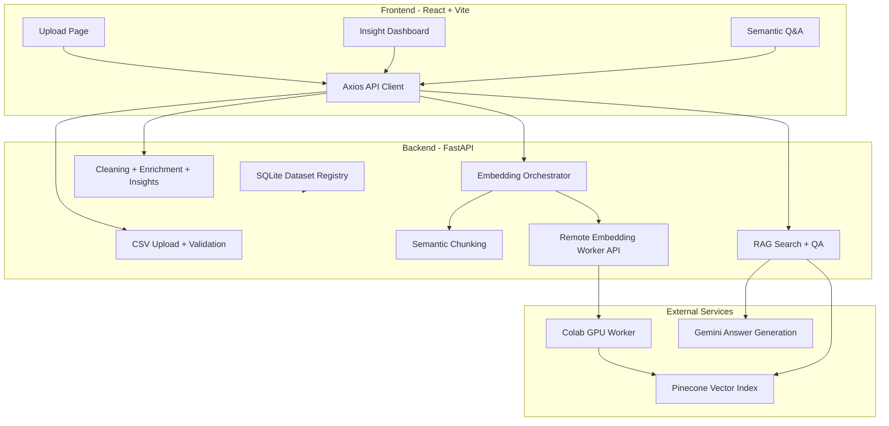

# TextLens AI - Implementation Plan

> Stack: React + Vite frontend, FastAPI backend, SQLite dataset registry, pandas analytics pipeline, SentenceTransformer embeddings, Pinecone vector search, Gemini grounded QA.
> Current status: Phases 1-3 are implemented for the MVP. Phase 4 retrieval intelligence is in progress.

---

## Current Architecture



---

## Completed Work

| Area | Status | Notes |
|---|---:|---|
| CSV upload and ingestion | Complete | Upload, validation, text column detection, dataset registration, preview. |
| Dataset registry | Complete | SQLite-backed dataset metadata. |
| Upload page | Complete | Drag/drop upload, progress, ingestion report, preview. |
| Upload state persistence | Complete | Last upload result and selected dataset persist across navigation. |
| Schema detection | Complete | Detects text, numeric, categorical, datetime. |
| Column role detection | Complete | Primary text, secondary text, content, engagement, time, geo. |
| Data cleaning | Complete | HTML/URL removal, text normalization, null fill, duplicate removal. |
| Sentiment enrichment | Complete | Lightweight local sentiment for primary text. |
| Insight dashboard | Complete | Dataset-level content, engagement, time, geo, and key insights. |
| Chart generation | Complete | Insight-driven chart generation with duplicate and chart-count guards. |
| Clean dataset download | Complete | UTF-8 CSV download after analysis. |
| Semantic chunking | Complete | JSONL chunk artifacts with resumable metadata. |
| Local embedding path | Complete | SentenceTransformer `all-MiniLM-L6-v2`, CPU/GPU device selection. |
| Pinecone vector store | Complete | Dimension-specific index naming, namespace-per-dataset, retries, resumability. |
| Pinecone gRPC upload | Complete | gRPC data-plane upserts, cached index clients, timing logs. |
| Remote Colab embedding worker | Complete | Backend queues jobs, Colab embeds on GPU, Colab upserts directly to Pinecone. |
| Semantic search | Complete | Query embedding -> Pinecone query -> normalized supporting rows. |
| Grounded Q&A | Complete | Gemini/fallback answers over retrieved rows with citations. |
| Q&A frontend | Complete | Dataset selector, embedding progress, search, Ask panel, supporting rows. |

---

## Phase 1 - Upload, Dataset Registry, and API Foundation

Status: Complete

### Backend

- [x] FastAPI app scaffold with CORS.
- [x] `POST /api/upload` for CSV upload.
- [x] `GET /api/datasets` for dataset listing.
- [x] `GET /api/datasets/{dataset_id}/preview` for clean data preview.
- [x] SQLite dataset registry.
- [x] Upload metadata: original filename, file path, clean CSV path, report path, status.
- [x] Test coverage for upload and preview flow.

### Frontend

- [x] Vite + React app scaffold.
- [x] Sidebar shell and route structure.
- [x] Upload page with drag/drop and upload progress.
- [x] Ingestion report UI with stats, validation issues, and quick insights.
- [x] Clean data preview table.
- [x] API service layer for upload, datasets, preview, analysis.
- [x] Persist last upload result and selected dataset ID.

---

## Phase 2 - Cleaning, Enrichment, Insight Dashboard

Status: Complete for current MVP

### Backend

- [x] `POST /api/datasets/{dataset_id}/analyze`.
- [x] `GET /api/datasets/{dataset_id}/analysis`.
- [x] Shape-based schema detection.
- [x] Semantic column role detection.
- [x] Cleaning pipeline:
  - empty row removal
  - text cleanup
  - null filling
  - duplicate row removal
  - numeric/datetime coercion
- [x] Cleaning report and clean CSV persistence.
- [x] Sentiment enrichment for primary text.
- [x] Keyword extraction for primary text.
- [x] Dataset-level insight generation.
- [x] Insight-driven chart generation.
- [x] `GET /api/download/clean-dataset/{dataset_id}`.

### Frontend

- [x] Dashboard dataset selector.
- [x] Analyze/Re-analyze action.
- [x] Overview stat cards.
- [x] Cleaning summary display.
- [x] Key Insights section.
- [x] Content, Engagement, Time, and Geo-capable chart sections.
- [x] Clean CSV download button.

---

## Phase 3 - Semantic Search, Q&A, and Scalable Ingestion

Status: Complete for current MVP

### Backend

- [x] Embedding service using SentenceTransformer `all-MiniLM-L6-v2`.
- [x] Same embedding model contract for indexing and retrieval.
- [x] Dataset-aware Pinecone vector store.
- [x] Dimension-specific index naming, such as `textlens-ai-384`.
- [x] Namespace-per-dataset storage.
- [x] Resumable embedding checkpoints.
- [x] Separate embedding batch size and Pinecone upsert batch size.
- [x] Pinecone gRPC data-plane upload with cached index clients.
- [x] Timing logs for embed, payload creation, upsert, and vectors/sec.
- [x] Local async embedding path.
- [x] Remote Colab GPU worker mode:
  - [x] `EMBEDDING_EXECUTION_MODE=remote_colab`
  - [x] worker token authentication
  - [x] claim job endpoint
  - [x] chunk download endpoint
  - [x] progress endpoint
  - [x] complete/fail endpoints
  - [x] Colab worker script
- [x] Semantic search endpoint.
- [x] Grounded Q&A endpoint with Gemini/fallback mode.

### Frontend

- [x] Q&A page.
- [x] Dataset context indicator.
- [x] Embedding status/progress polling.
- [x] Semantic search panel.
- [x] Ask panel.
- [x] Supporting rows display.
- [x] Mode indicator for LLM/fallback answers.

### Performance Notes

- Local CPU ingestion of 43,206 vectors previously took about 5,153 seconds.
- Colab GPU worker completed the same scale in about 186 seconds.
- Pinecone gRPC upload from Colab reached hundreds of vectors/sec in observed runs.
- Current ingestion bottleneck has shifted away from local CPU and toward retrieval quality/product intelligence.

---

## Phase 4 - Retrieval Intelligence and Analytics-Aware QA

Status: In progress

### Problem

The current RAG path treats most questions the same way:

```text
question -> embed query -> Pinecone top_k -> Gemini answer over retrieved rows
```

This works for semantic evidence questions, but it is weak for global dataset questions like:

- "What are the most frequent topics?"
- "What do users complain about most?"
- "Summarize all comments."
- "What percentage is negative?"
- "What are the top issues over time?"

Those questions need query classification and analytics-aware retrieval, not only top-5 semantic similarity.

### Phase 4 Goals

- Classify the user's query before retrieval.
- Choose the right strategy based on query intent.
- Dynamically set `top_k`, filters, context shape, and prompt style.
- Route aggregate/frequency questions to pandas/topic analytics instead of pure vector RAG.
- Improve prompts so answers are grounded, concise, readable, and honest about evidence limits.
- Return a retrieval plan/debug payload internally so we can evaluate behavior.

### Query Types

| Query type | Examples | Primary strategy |
|---|---|---|
| `factual` | "What is DB issue?", "Who mentioned X?" | Small semantic retrieval, direct evidence answer. |
| `semantic_exploration` | "What do users complain about?", "Why did people lose interest?" | Larger semantic retrieval, cluster/summarize retrieved rows. |
| `summarization` | "Summarize the comments", "What is the audience mainly discussing?" | Broad retrieval plus dataset summary artifacts. |
| `aggregation` | "Most common issues?", "Top topics?", "Sentiment distribution?" | Pandas/topic analytics over cleaned CSV/chunks, not only Pinecone. |
| `trend` | "How did complaints change over time?" | Time-aware aggregation plus sampled evidence rows. |
| `comparison` | "Compare positive vs negative comments" | Grouped analytics plus evidence rows per group. |
| `unsupported` | Questions unrelated to dataset | Refuse or ask for clarification. |

### Proposed Backend Design

Add a retrieval intelligence layer:

```text
QA request
  -> QueryClassifier
  -> RetrievalPlanner
  -> Strategy execution
  -> Evidence/analytics package
  -> PromptBuilder
  -> QAService
```

New modules:

- `backend/app/services/query_intent_service.py`
  - heuristic classifier first - implemented
  - optional LLM classifier later
  - returns intent, confidence, entities, filters, rationale

- `backend/app/services/retrieval_planner.py`
  - maps intent to retrieval parameters - implemented
  - controls `top_k`, thresholds, metadata filters, and strategy

- `backend/app/services/analytics_qa_service.py`
  - loads cleaned CSV and/or chunk JSONL - initial version implemented
  - computes keyword/topic frequencies, sentiment summaries, time trends, group comparisons
  - returns aggregate facts plus representative evidence rows

- `backend/app/services/prompt_builder.py`
  - separate prompts for factual, exploratory, summary, aggregation, trend, and comparison answers - initial version implemented
  - no raw markdown unless frontend supports markdown rendering

### Retrieval Strategy Matrix

| Intent | top_k | Filters | Context sent to LLM |
|---|---:|---|---|
| `factual` | 3-5 | optional entity/metadata filters | direct rows only |
| `semantic_exploration` | 8-10 | optional sentiment/time filters | retrieved rows grouped by theme |
| `summarization` | 10 + cached summary | none or broad | summary stats plus representative rows |
| `aggregation` | 0-5 evidence rows | computed groups | aggregate table plus examples |
| `trend` | 0-8 evidence rows | time column required | time buckets plus examples |
| `comparison` | 0-10 evidence rows | group-by fields | grouped metrics plus examples |

### Prompt Improvements

- Use intent-specific system instructions.
- Require short structured answers.
- Include evidence limits:
  - "Based on the retrieved rows..."
  - "Based on aggregate analysis of the cleaned dataset..."
- For aggregation, include computed numbers before asking the LLM to write prose.
- Avoid unsupported global claims from small top-k samples.
- Tell the model not to use markdown unless the frontend supports markdown rendering.
- Make citations consistent:
  - `Row 12345`
  - no `12345.0`

### Frontend Improvements

- Show answer mode:
  - Semantic RAG
  - Analytics
  - Hybrid
- Show "strategy used" in the operation log.
- Consider default `top_k=8` for exploratory Ask questions.
- Add suggested starter questions grouped by type:
  - Search evidence
  - Summarize
  - Find complaints
  - Compare sentiment
  - Topic frequency
- Either render markdown safely or require plain text answers.

### Phase 4 Implementation Steps

1. Add query intent classification.
   - [x] Start with deterministic heuristics.
   - [x] Add tests for common query examples.

2. Add retrieval planner.
   - [x] Map intent to `top_k`, strategy, and prompt type.
   - [x] Log the selected plan.

3. Split QA prompt construction by intent.
   - [x] Factual prompt.
   - [x] Exploration prompt.
   - [x] Aggregation prompt.
   - [x] Summary prompt.

4. Add analytics QA path for aggregation questions.
   - [x] Frequency keywords/topics.
   - [x] Sentiment distribution.
   - [ ] Engagement/time grouped summaries when columns exist.
   - [x] Representative evidence rows.

5. Add hybrid answers.
   - [x] Use analytics facts for global claims.
   - [x] Use Pinecone rows for examples and citations.

6. Update API response shape.
   - [x] Include `mode`, `intent`, `strategy`, optional `analytics`, and `supporting_rows`.
   - [x] Keep backward compatibility for the current frontend.

7. Update frontend.
   - [x] Display strategy.
   - [ ] Display intent.
   - [ ] Improve answer formatting.
   - [ ] Add suggested questions.

8. Evaluate with a small query test suite.
   - Factual questions.
   - Complaint/theme questions.
   - Frequency/topic questions.
   - Summary questions.
   - Bad/off-topic questions.

---

## Phase 5 - Advanced Insights

Status: Planned after Phase 4 foundation

### Backend

- [ ] Topic clustering over chunks/comments.
- [ ] FAQ extraction.
- [ ] Issue taxonomy.
- [ ] Trend detection across time.
- [ ] Executive summary generation.
- [ ] Emotion classification.
- [ ] Cached analysis artifacts for large datasets.

### Frontend

- [ ] Executive summary card.
- [ ] FAQ panel.
- [ ] Issue taxonomy view.
- [ ] Topic and emotion charts.
- [ ] Trend comparison views.

---

## Phase 6 - Reports and Exports

Status: Partially started

### Completed

- [x] Clean dataset CSV download.

### Planned

- [ ] Enriched CSV download.
- [ ] PDF report generation.
- [ ] Report preview page.
- [ ] Multi-format ingestion:
  - TXT
  - JSONL
  - XLSX
  - Parquet
- [ ] Raw text paste upload.

---

## Phase 7 - Production Hardening

Status: Planned

### Backend

- [ ] Replace Colab prototype with managed GPU worker infrastructure.
- [ ] Durable job queue for embedding and analysis.
- [ ] Worker heartbeats and stale job recovery.
- [ ] Signed artifact URLs instead of tunneled local file download.
- [ ] Structured logging and trace IDs.
- [ ] Better error taxonomy.
- [ ] Rate limiting.
- [ ] Dockerfile and docker-compose.
- [ ] Secrets management; never commit `.env`.

### Frontend

- [ ] Error boundaries.
- [ ] More complete responsive QA.
- [ ] Accessibility pass.
- [ ] Code splitting for large dashboard bundle.
- [ ] Better toast/notification system shared across pages.
- [ ] Optional theme toggle.

---

## API Endpoint Summary

| Method | Endpoint | Status | Description |
|---|---:|---|
| `POST` | `/api/upload` | Complete | Upload CSV and run ingestion. |
| `GET` | `/api/datasets` | Complete | List uploaded datasets. |
| `GET` | `/api/datasets/{dataset_id}/preview` | Complete | Preview clean ingestion CSV. |
| `POST` | `/api/datasets/{dataset_id}/analyze` | Complete | Run cleaning, enrichment, insights, charts. |
| `GET` | `/api/datasets/{dataset_id}/analysis` | Complete | Retrieve saved analysis JSON. |
| `GET` | `/api/download/clean-dataset/{dataset_id}` | Complete | Download cleaned UTF-8 CSV. |
| `POST` | `/api/datasets/{dataset_id}/embed` | Complete | Start local or remote embedding job. |
| `POST` | `/api/embed` | Complete | Contract-first embedding endpoint used by frontend. |
| `POST` | `/api/search` | Complete | Semantic search in a dataset namespace. |
| `POST` | `/api/qa` | Complete | Ask dataset-grounded questions. |
| `POST` | `/api/workers/embedding/jobs/claim` | Complete | Remote worker claims queued embedding job. |
| `GET` | `/api/workers/embedding/jobs/{dataset_id}/chunks` | Complete | Remote worker downloads prepared chunk JSONL. |
| `POST` | `/api/workers/embedding/jobs/{dataset_id}/progress` | Complete | Remote worker reports progress. |
| `POST` | `/api/workers/embedding/jobs/{dataset_id}/complete` | Complete | Remote worker completes embedding job. |
| `POST` | `/api/workers/embedding/jobs/{dataset_id}/fail` | Complete | Remote worker fails embedding job. |
| `GET` | `/api/datasets/{dataset_id}/export/pdf` | Planned | Download PDF report. |
| `GET` | `/api/datasets/{dataset_id}/export/csv` | Planned | Download enriched CSV. |

---

## Immediate Next Work

1. Build Phase 4 query intent classification with tests.
2. Add a retrieval planner that chooses semantic, analytics, or hybrid strategy.
3. Add analytics QA for aggregation/frequency questions.
4. Improve prompt templates and citation formatting.
5. Update the Q&A UI to show the selected answer strategy.
6. Add a small retrieval evaluation set to prevent regressions.
